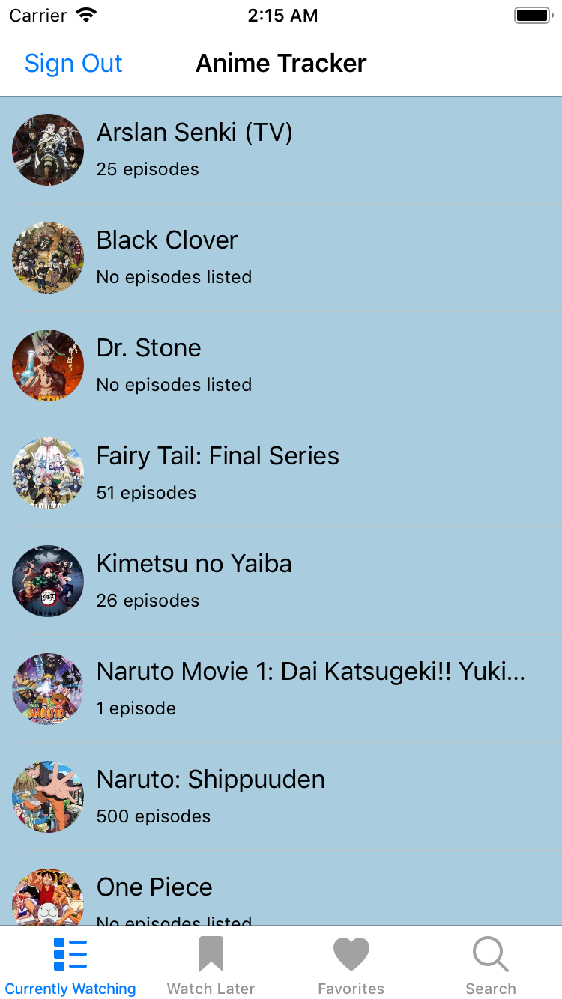
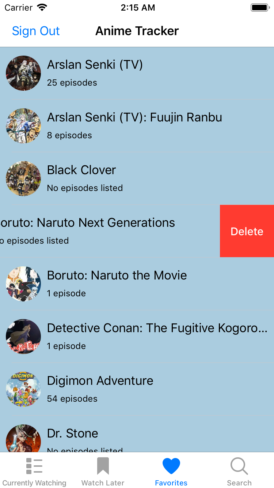

# Udacity iOS Developer Nanodegree - animetracker App
This repository contains the animetracker app for Udacity's Capstone Project. This app connects to a public RESTful API (Jikan) to 
download animes and utilizes Firebase to save user registration information, as well as user anime lists.

## Overview
When the user first opens the app, the user will be presented with the sign in screen. If the user has not created an account with 
animetracker yet, the user can go to the sign up screen to register. After the user is registered, the user will be taken back to the 
sign in screen to enter their sign in information and be authenticated.

 

Once the user is inside the app, the user can view his or her saved anime lists by clicking on the tabs for the following categories: 
currently watching, watch later, and favorites. The user can click on the search tab to search for animes in the Jikan API's database.
The search results will display 20 animes that the user can view.

  

Clicking on an anime takes the user to a detail view where the user can see the anime's full title, current status, number of episodes, 
summary, and image. The user can click on the image to zoom in on it, and click it again to zoom out. On the upper right hand corner by
the image, the user can click any of the three icons to add the anime to his or her currently watching list, watch later list, or 
favorites list. The icon will be highlighted to indicate that the anime is added to the respective list and saved in Firebase. Clicking on
a highlighted icon will remove the anime from that respective list.

  

Going back to the app and clicking on the different tabs will present the list of animes saved in that category. The user can click any of
the animes to see the detail view for it. The user can also swipe left on an anime to delete it from that category.

   

Clicking the "Sign Out" button on the top presents the user with a confirmation alert. Confirming the action brings the user back to the 
sign in screen.

